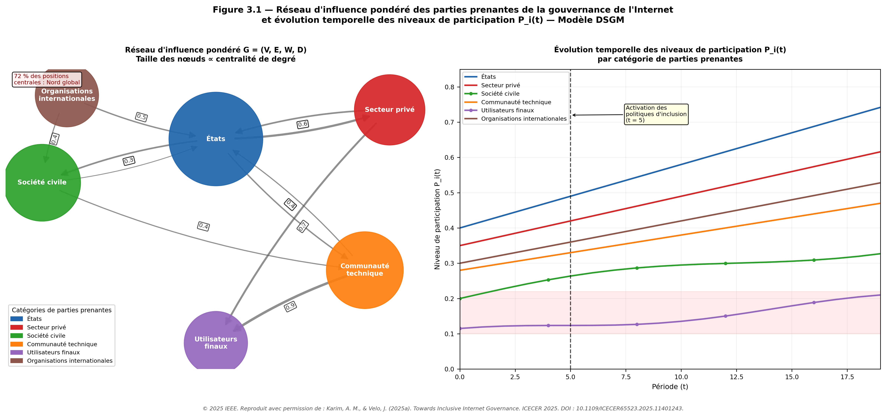
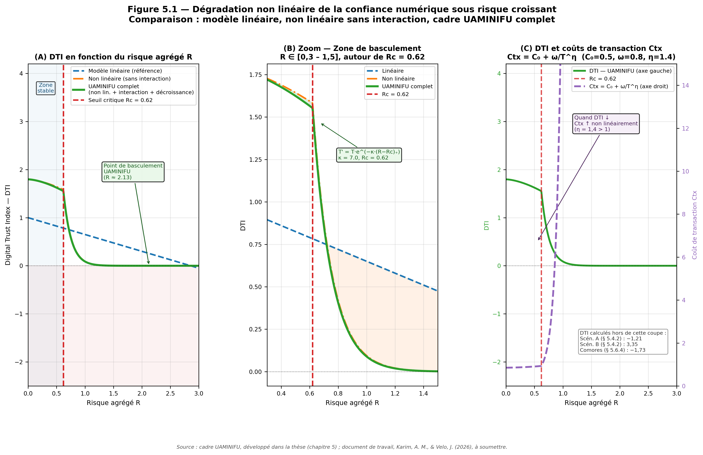
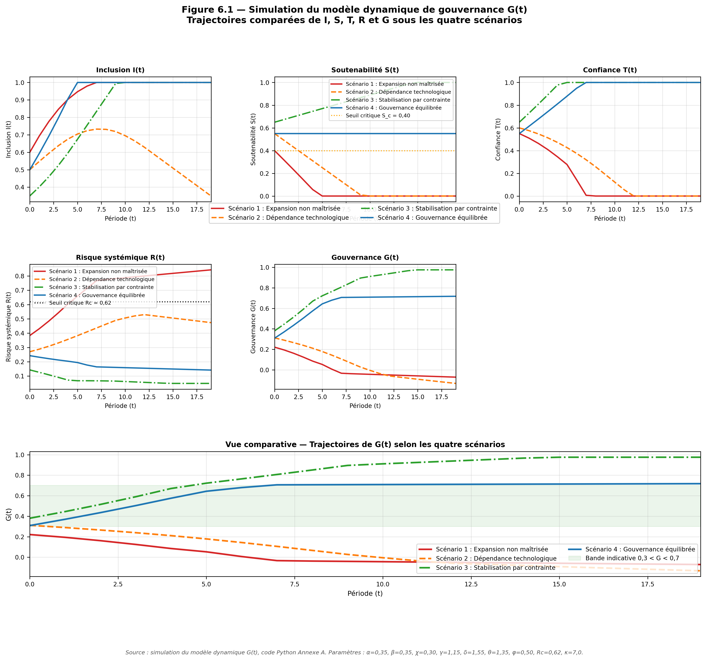
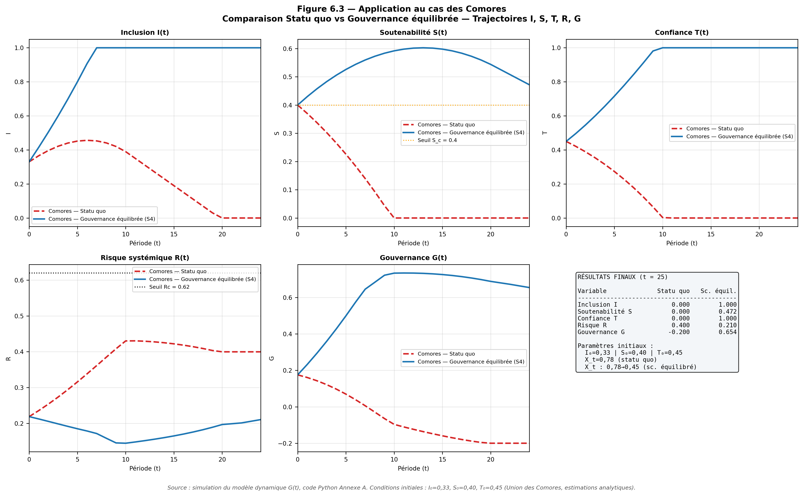

# Gouvernance systémique du numérique : modélisation I–S–T

[](LICENSE)
[](https://www.python.org/)
[](https://doi.org/10.5281/zenodo.20242474)

> **Dépôt de code associé à la thèse de doctorat :**
>
> *Vers une gouvernance inclusive, durable et fiable du numérique :
> modélisation systémique de l'inclusion, de la soutenabilité et de la
> confiance à l'ère de l'intelligence artificielle*
>
> **Karim Attoumani Mohamed** & **Jérôme Velo**
> Université de Toamasina — Faculté des Sciences et Technologies
> Thèse de doctorat en Informatique (Génie informatique)
> ÉAD MIASE — École doctorale SCSD, 2026

---

## À propos de cette recherche

Cette thèse propose un cadre systémique intégré de gouvernance du numérique
articulant trois variables structurantes interdépendantes :

- **I — Inclusion** : capacité des acteurs à participer effectivement aux
  espaces de gouvernance et aux bénéfices du numérique
- **S — Soutenabilité** : capacité des infrastructures numériques à fonctionner
  durablement sous contraintes énergétiques, computationnelles et environnementales
- **T — Confiance** : condition de légitimité et de stabilité des interactions
  numériques

Ces trois variables sont formalisées dans un modèle dynamique de gouvernance G(t) :

```
G_t = α·I_t^γ + β·S_t^δ + χ·T_t^θ − φ·R_t

R_t = r₁·A_t·I_t·(1−S_t) + r₂·(1−T_t)·X_t + r₃·A_t·X_t
```

où R_t est le risque systémique, A_t l'intensité des usages IA et X_t
la dépendance externe du système.

**Paramètres calibrés :**

| Paramètre | Valeur | Description |
|-----------|--------|-------------|
| α | 0,35 | Poids de l'inclusion I |
| β | 0,35 | Poids de la soutenabilité S |
| χ | 0,30 | Poids de la confiance T |
| γ | 1,15 | Exposant non-linéarité I |
| δ | 1,55 | Exposant non-linéarité S |
| θ | 1,35 | Exposant non-linéarité T |
| φ | 0,50 | Sensibilité au risque systémique |
| Rc | 0,62 | Seuil critique de dégradation de T |
| κ | 7,0 | Vitesse de décroissance exponentielle de T |

---

## Publications associées

Cette thèse est structurée comme une thèse sur articles. Deux contributions
publiées et un document de travail intégré à la thèse constituent les
piliers empiriques des variables I, S et T.

| Contribution | Statut | Variable | DOI |
|---|---|---|---|
| Karim & Velo (2025a) — *Towards Inclusive Internet Governance: A Multidimensional Analysis of Systemic Barriers and Reform Strategies* | **Publié** — IEEE ICECER 2025 | I | [10.1109/ICECER65523.2025.11401243](https://doi.org/10.1109/ICECER65523.2025.11401243) |
| Karim & Velo (2025b) — *Towards Sustainable Internet Governance: Energy and Bandwidth Challenges in the Era of AI* | **Publié** — IEEE ICECER 2025 | S | [10.1109/ICECER65523.2025.11401095](https://doi.org/10.1109/ICECER65523.2025.11401095) |
| Karim & Velo (2026) — *UAMINIFU: Modeling Digital Trust as a Systemic and Economic Variable for AI-Driven Digital Sovereignty* | **Document de travail** intégré à la thèse (chapitre 5), à soumettre | T | — |

---

## Contenu du dépôt

```
these-gouvernance-numerique-IST/
│
├── README.md                        ← Ce fichier
├── LICENSE                          ← MIT License
├── requirements.txt                 ← Dépendances Python
│
├── simulation/
│   └── generate_figures.py          ← Code de génération des 8 figures
│
├── figures/                         ← Chaque figure en PNG (300 dpi) et SVG
│   ├── Figure_3_1_DSGM_reseau_participation.png / .svg
│   ├── Figure_3_2_participation_scenarios.png / .svg
│   ├── Figure_4_1_energie_Afrique_2030.png / .svg
│   ├── Figure_4_2_lambda_orchestration.png / .svg
│   ├── Figure_5_1_UAMINIFU_trust_degradation.png / .svg
│   ├── Figure_6_1_quatre_scenarios.png / .svg
│   ├── Figure_6_2_sensibilite_lambda.png / .svg
│   └── Figure_6_3_cas_Comores.png / .svg
│
└── data/
    └── README_donnees.md            ← Description des sources de données
```

### Organisation du code (`generate_figures.py`)

| Section | Figure | Contenu |
|---------|--------|---------|
| 1 | — | Dépendances et configuration commune |
| 2 | **3.1** | Réseau d'influence pondéré DSGM et participation P_i(t) |
| 3 | **3.2** | Simulation participation sous trois scénarios d'inclusion |
| 4 | **4.1** | Projections énergétiques, bande passante et carbone — Afrique 2024-2030 |
| 5 | **4.2** | Effet du coefficient d'orchestration λ sur Q'(t) |
| 6 | **5.1** | Dégradation non linéaire de la confiance — cadre UAMINIFU |
| 7 | **6.1, 6.2, 6.3** | Modèle G(t) : quatre scénarios, sensibilité λ, cas des Comores |

---

## Installation

### Prérequis

- Python 3.9 ou supérieur
- pip

### Cloner le dépôt

```bash
git clone https://github.com/karimattoumanimohamed/these-gouvernance-numerique-IST
cd these-gouvernance-numerique-IST
```

### Installer les dépendances

```bash
pip install -r requirements.txt
```

---

## Utilisation

### Générer toutes les figures

```bash
python simulation/generate_figures.py
```

Les huit figures sont sauvegardées dans le répertoire courant, chacune en
PNG (300 dpi) et en SVG (vectoriel), sous les noms suivants (extension
`.png` et `.svg`) :

```
Figure_3_1_DSGM_reseau_participation.png
Figure_3_2_participation_scenarios.png
Figure_4_1_energie_Afrique_2030.png
Figure_4_2_lambda_orchestration.png
Figure_5_1_UAMINIFU_trust_degradation.png
Figure_6_1_quatre_scenarios.png
Figure_6_2_sensibilite_lambda.png
Figure_6_3_cas_Comores.png
```

### Modifier les paramètres du modèle

Les paramètres du modèle G(t) sont centralisés dans la classe
`ModelParameters` (Section 7 du code). Pour explorer d'autres
configurations :

```python
from simulation.generate_figures import ModelParameters, run_simulation_G

# Modifier les paramètres
params = ModelParameters(
    gamma=1.20,   # Augmenter la non-linéarité de I
    delta=1.60,   # Augmenter la non-linéarité de S
    Rc=0.55       # Abaisser le seuil critique de T
)

# Lancer une simulation personnalisée
# (voir Section 7 pour la définition de ScenarioConfig)
```

### Appliquer le modèle à un nouveau contexte

Pour adapter le modèle à un autre pays ou contexte du Sud global,
modifiez les conditions initiales dans la fonction `generate_figure_6_3()` :

```python
# Exemple : adapter au contexte du Vanuatu
sc_custom = ScenarioConfig(
    name  = "Vanuatu — Statu quo",
    I0    = 0.28,   # Taux de pénétration Internet
    S0    = 0.38,   # Capacité infrastructurelle
    T0    = 0.42,   # Niveau de confiance numérique estimé
    ...
)
```

---

## Figures produites

### Figure 3.1 — Réseau DSGM et participation


### Figure 5.1 — Dégradation non linéaire UAMINIFU


### Figure 6.1 — Quatre scénarios de gouvernance G(t)


### Figure 6.3 — Application au cas des Comores


---

## Résultats clés

Les résultats ci-dessous sont ceux du manuscrit final de la thèse (2026).
Lorsqu'ils diffèrent de ceux des articles, l'écart est signalé ; voir aussi
la section [Écarts articles → thèse](#écarts-articles--thèse-version-20).

### Asymétries de participation (Figure 3.1 — Karim & Velo, 2025a)
- 92 % des positions de leadership à l'IETF sont détenues par le Nord global
- La proximité géographique des lieux de réunion explique 68 % de la variance
  de la participation (R² = 0,68, p < 0,01)
- Des réformes ciblées pourraient accroître la participation du Sud global
  de 120 à 150 % en cinq ans (modèle DSGM, R² = 0,82)

### Contraintes énergétiques (Figures 4.1 et 4.2 — Karim & Velo, 2025b)
- Une interaction IA consomme 145 à 250 fois plus d'énergie qu'un usage web
  selon les estimations de 2023 retenues dans l'article ; environ 12 à 15 fois
  selon les mesures publiées en 2025 (Epoch AI ; Google)
- Pour 600 millions d'utilisateurs africains à l'horizon 2030, la demande
  projetée de 174 à 300 GWh/jour équivaut à 7 à 12,5 GW en puissance moyenne,
  soit de 7 à 11 % de la production électrique africaine (965 TWh en 2024,
  Ember). L'article annonçait « plus de 15 % de la capacité installée », sans
  dénominateur sourcé (thèse, § 4.3)
- La trajectoire du scénario B (468 GWh/jour en 2030) résulte d'une double
  projection et doit être lue comme une borne haute exploratoire
- Le coefficient d'orchestration λ rend visible une charge de calcul
  invisible ; l'article pose un seuil indicatif vers λ ≈ 40, qui n'est pas
  dérivé d'une mesure de capacité

### Dégradation de la confiance (Figure 5.1 — cadre UAMINIFU, chapitre 5)
- Au-delà du seuil Rc = 0,62, la dégradation de T s'accélère
  exponentiellement selon T' = T·e^(−κ·(R−Rc)₊)
- Le modèle linéaire sous-estime fortement la vitesse de dégradation
- La confiance a des implications économiques directes : Ctx = C₀ + ω/T^η
- Instancié exclusivement sur sources publiques (GSMA Digital Africa Index,
  ITU GCI 2024, loi comorienne du 26 juin 2014) et complété par un
  questionnaire d'élicitation d'experts (n = 8), le DTI place les Comores en
  zone d'effondrement (DTI ≈ −1,73), résultat robuste à l'analyse de
  sensibilité (thèse, § 5.6.4)

### Dynamique de gouvernance (Figures 6.1 à 6.3 — modèle G(t))
- L'amélioration isolée d'une variable ne garantit pas l'amélioration de G
- Seuls les scénarios 3 (stabilisation par contrainte) et 4 (gouvernance
  équilibrée) maintiennent G sur une trajectoire favorable. Le scénario 3
  atteint le niveau le plus élevé (G ≈ 0,98 à t = 19), avec un usage de l'IA
  contraint (A = 0,3) ; le scénario 4 y parvient avec un usage soutenu
  (A = 0,5 ; G ≈ 0,72)
- Dans la simulation, l'intensité d'usage A_t = min(1 ; 0,3·λ/10) sature dès
  λ ≈ 34 : la Figure 6.2 ne permet donc pas d'établir le seuil λ ≈ 40 de façon
  indépendante
- Cas des Comores (horizon de 25 périodes) : G = −0,200 en statu quo contre
  G = 0,654 sous gouvernance équilibrée
- Trois boucles de rétroaction critiques : I→S→T, T→I→S, X_t→R→T

---

## Écarts articles → thèse (version 2.0)

La version 1.0 de ce dépôt (2025) reprenait les résultats des articles. La
version 2.0 (2026) aligne le dépôt sur le manuscrit final. **Aucun calcul
n'a été modifié** : les courbes sont identiques ; seuls des libellés,
annotations et commentaires ont changé.

| Élément | Version 1.0 | Version 2.0 | Référence thèse |
|---|---|---|---|
| Figure 4.1 — seuil énergétique | Ligne « 15 % de la capacité africaine ≈ 131 GWh/j » et ligne « % capacité africaine » (53,6 %) calculées sur 874 GWh/j | Retirées : le dénominateur 874 n'était pas sourcé ; il correspond vraisemblablement à la demande électrique africaine de 2019 (874 TWh/an) lue comme des GWh/jour | § 4.3 |
| Figure 4.1 — E₀ | E₀ = 174 GWh/j présenté comme la consommation de 2024 | E₀ correspond à la demande de 600 M d'utilisateurs en 2030 ; le scénario B est une borne haute | § 4.3 |
| Figure 4.2 — λ_c | « Seuil critique λ_c = 40 », « capacité africaine systématiquement dépassée » | « Seuil indicatif λ ≈ 40 (hypothèse de l'article) » | § 4.3.4 |
| Figure 5.1 — coût de transaction | Ctx = C₀ + θ/T^η | Ctx = C₀ + ω/T^η (θ est réservé à l'exposant de T dans G(t)) | chap. 5 |
| Figure 5.1 — source | « Manuscrit soumis, CARI 2026 » | Cadre UAMINIFU, chapitre 5 (document de travail) | chap. 5 |
| Figure 5.1 — scénarios A et B | Points DTI = −1,06 et 3,59 placés sur le panneau C, hors de la courbe | Valeurs recalculées avec les exposants exacts et la décroissance sur R̄ = ΣRⱼ/6 (convention du § 5.6.4), soit −2,69 et 3,60, rappelées dans un encadré avec le DTI des Comores (−1,73) : elles ne relèvent pas de la coupe stylisée tracée | § 5.4.2 |
| Figure 6.1 — bande verte | « Zone de gouvernance stable » | « Bande indicative 0,3 < G < 0,7 » | § 6.4.1 |
| Figure 6.2 | Annotation « λ_c ≈ 40 (seuil critique africain) » ; seuil S_c tracé aussi sur le panneau G | Annotation retirée ; saturation A_t = 1 pour λ ≥ 34 indiquée ; S_c tracé sur le seul panneau S | § 6.4.2 |
| Figure 6.3 | Ligne « S₀ initial » tracée à 0,33 (valeur de I₀) | Ligne retirée | § 6.5 |
| Formats | PNG 300 dpi | PNG 300 dpi et SVG vectoriel | Annexe A |

---

## Reproductibilité et principes FAIR

Ce dépôt adhère aux principes FAIR (Wilkinson et al., 2016) :

- **Findability** — dépôt indexé sur GitHub avec DOI Zenodo permanent
- **Accessibility** — code et figures librement accessibles sous licence MIT
- **Interoperability** — formats standards : Python 3.9+, PNG 300 dpi,
  SVG, Markdown
- **Reusability** — documentation complète, paramètres détaillés,
  licence explicite, extension facilitée à d'autres contextes

**Référence FAIR :**
Wilkinson, M. D., et al. (2016). The FAIR Guiding Principles for scientific
data management and stewardship. *Scientific Data, 3*, 160018.
https://doi.org/10.1038/sdata.2016.18

---

## Citation

**Archivage Zenodo**

| Version | DOI |
|---|---|
| Toutes versions (DOI de concept, renvoie à la dernière version) | [10.5281/zenodo.20242474](https://doi.org/10.5281/zenodo.20242474) |
| v2.0 — version de la thèse (2026) | [10.5281/zenodo.23063106](https://doi.org/10.5281/zenodo.23063106) |
| v1.0 — état des articles publiés (2025) | [10.5281/zenodo.20242475](https://doi.org/10.5281/zenodo.20242475) |

Si vous utilisez ce code ou ces résultats dans vos travaux, merci de citer :

```bibtex
@phdthesis{karim2026these,
  author  = {Karim Attoumani Mohamed},
  title   = {Vers une gouvernance inclusive, durable et fiable du
             num{\'e}rique : mod{\'e}lisation syst{\'e}mique de
             l'inclusion, de la soutenabilit{\'e} et de la confiance
             {\`a} l'{\`e}re de l'intelligence artificielle},
  school  = {Universit{\'e} de Toamasina},
  year    = {2026},
  type    = {Th{\`e}se de doctorat en Informatique
             (G{\'e}nie informatique)},
  url     = {https://github.com/karimattoumanimohamed/
             these-gouvernance-numerique-IST}
}

@inproceedings{karim2025a,
  author    = {Karim, A. M. and Velo, J.},
  title     = {Towards Inclusive Internet Governance: A Multidimensional
               Analysis of Systemic Barriers and Reform Strategies},
  booktitle = {Proceedings of ICECER 2025},
  year      = {2025},
  doi       = {10.1109/ICECER65523.2025.11401243}
}

@inproceedings{karim2025b,
  author    = {Karim, A. M. and Velo, J.},
  title     = {Towards Sustainable Internet Governance: Energy and
               Bandwidth Challenges in the Era of AI},
  booktitle = {Proceedings of ICECER 2025},
  year      = {2025},
  doi       = {10.1109/ICECER65523.2025.11401095}
}

@software{karim2026code,
  author    = {Karim Attoumani Mohamed and Jérôme Velo},
  title     = {these-gouvernance-numerique-IST : code source et figures
               de la th{\`e}se (version 2.0)},
  year      = {2026},
  publisher = {Zenodo},
  version   = {v2.0},
  doi       = {10.5281/zenodo.23063106}
}

@unpublished{karim2026uaminifu,
  author = {Karim, A. M. and Velo, J.},
  title  = {UAMINIFU: Modeling Digital Trust as a Systemic and Economic
            Variable for AI-Driven Digital Sovereignty},
  note   = {Document de travail int{\'e}gr{\'e} {\`a} la th{\`e}se,
            Universit{\'e} de Toamasina},
  year   = {2026}
}
```

---

## Licence

Ce dépôt est distribué sous licence **MIT**.
Vous êtes libre de l'utiliser, le modifier et le redistribuer sous
condition de mention des auteurs originaux.

Voir le fichier [LICENSE](LICENSE) pour les termes complets.

---

## Contact

**Karim Attoumani Mohamed**
Université de Toamasina — Faculté des Sciences et Technologies
attoukarim@gmail.com

**Jérôme Velo** (directeur de thèse)
Université de Toamasina — Faculté des Sciences et Technologies
zjvelo@gmail.com

---

*Dépôt créé en 2025 — Version 2.0 (2026), alignée sur le manuscrit final de la thèse*
